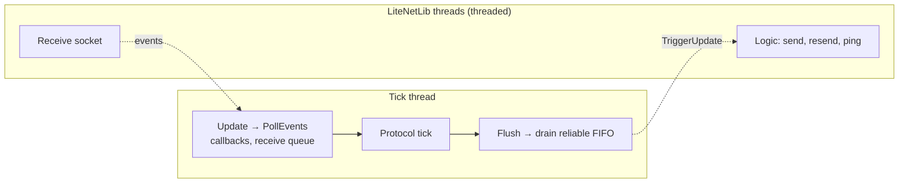

# Static ECS LiteNetLib transport

Adapts LiteNetLib 2.1.4 to the packet contract of `com.unigame.staticecs.network`.

Install LiteNetLib 2.1.4 with NuGetForUnity. The DLL must be restored as
`Assets/Packages/LiteNetLib.2.1.4/lib/netstandard2.1/LiteNetLib.dll`; upstream revision
`4d3de1e93abaead30199bf572f4a3363f854e14b`. The .NET SDK project uses the matching NuGet
package.

## I/O modes

| Mode | Socket I/O | Setting |
|---|---|---|
| Manual | On the tick thread: `PollEvents` and `ManualUpdate` | `ThreadedIo = false` |
| Threaded | LiteNetLib receive and logic threads; the tick thread only dispatches events and wakes the sender | `ThreadedIo = true` (server default) |

In both modes every listener callback runs on the tick thread inside `Update()`, so adapter
and protocol state stay single-threaded. Threaded mode makes the server tick 2–3× shorter.

## Contract

- Call `Update()` before protocol receives and `Flush()` after protocol sends; dispose every
  received `NetworkBufferLease`. `TrySend` consumes the lease on every result.
- `TrySend` reads only the packet header (CRC and length): callers pass packets they just
  encoded. The receive path verifies the full packet, payload hash included.
- Native MTU is 1200 bytes, with one channel. Reliable packets go up to 64 KiB, fragmented by
  LiteNetLib; sequenced packets are limited to one datagram.
- The receive queue, the reliable FIFO, delivery-ticket fragments and bytes are bounded per
  connection. Reliable receive overflow disconnects the peer; sequenced overflow drops the packet.

## Diagnostics

| Field | Meaning |
|---|---|
| `NativeReliableQueuePackets` | LiteNetLib queue only, without in-flight deliveries |
| `NativeSentPackets`, `NativeReceivedPackets` | Cumulative UDP datagrams |
| `NativeSentBytes`, `NativeReceivedBytes` | Datagram payload bytes, including control, fragment and resend traffic |
| `NativePacketLoss` | LiteNetLib's detected loss or resend accounting |

In threaded mode the pool and queue counters are sampled across threads, so they are approximate.
